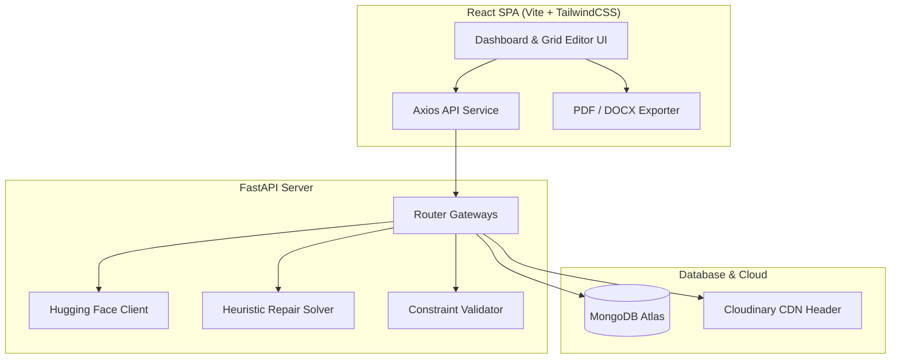

# 🗓️ Intelligent AI Time Table Generator Tool

A state-of-the-art, full-stack academic timetable scheduling system. The application combines **Large Language Model (LLM) reasoning** with **deterministic constraint-satisfaction algorithms** and an **interactive grid editor** to generate, refine, and manage conflict-free schedules across multiple divisions, classes, and instructors.

---

## 📌 Core Features

1. **AI-Driven Multi-Division Scheduling**
   - Automatically builds conflict-free schedules for multiple academic divisions (e.g. Div A, B, C...) sequentially.
   - Integrates the schedule of previous divisions as hard constraints into the generation loop of subsequent divisions to prevent overlaps.

2. **Interactive Timetable Grid Editor**
   - Toggle **Edit Mode** directly in the timetable display page.
   - Click any slot (including **"Free"** slots) to open a premium pop-up modal.
   - Assign/update the Subject, Lecturer, Room, and Session Type (Theory or Lab) dynamically.
   - Use the "Remove Lecture" option to clear occupied slots back to "Free".
   - Persists manual edits instantly to the MongoDB backend.

3. **Timetable Generation Speed Optimization**
   - Utilizes **`Qwen/Qwen2.5-Coder-32B-Instruct`** as the primary model on Hugging Face Serverless, responding in ~4 seconds.
   - Implements a fast fallback chain including `Qwen/Qwen2.5-7B-Instruct` (<1 second) and `Llama-3.1-8B-Instruct`.
   - Executes a local, deterministic **Constraint Repair Solver** (`repair_division_slots_full`) in <1ms to automatically resolve double-bookings and fill deficits. This guarantees validation success on the first attempt and eliminates slow LLM validation retry loops, cutting overall generation time from minutes to **under 15s per division**.

4. **Centralized Master Data Management (MDM) System**
   - **Staff Management**: Centralized repository of active/inactive staff, designation, department, available days, and designated weekly workload.
   - **Subject Registry**: Curriculum manager mapped to specific department streams, semesters, and credits with automatic laboratory requirements.
   - **Classrooms & Laboratories**: Distinguishes between general lecture rooms and specialized labs. Mapped directly into the timetable wizard and scheduling engine.

5. **Universal Layout Responsiveness**
   - Sleek and premium glassmorphic UI styled with TailwindCSS, optimized for:
     - **Mobile Screens**: Collapsible sidebar, horizontal scroll overlays for timetable tables.
     - **PC & Laptops**: Flexible grid grids and hover tooltip interactions.
     - **4k Monitors**: Centered max-width boundaries up to 2560px with padded layouts.

6. **Executive Dashboard Cockpit**
   - Metrics counter (scheduled periods, active lecturers, and total generated timetables).
   - Welcoming landing header displaying the current date and quick navigation to recent timetables.

7. **Official Report Exports**
   - Client-side download of division timetables as formatted **PDF documents** (using `jspdf` and `jspdf-autotable`) and **Word files** (using `docx`) complete with college letterhead headers and prepare/approval signature fields.

---

## 🏗️ Architecture & Data Flow



1. **Interactive Form Input**: The user configures institution settings, assigns active lecturers from the MDM registry, and schedules subjects per division.
2. **LLM Synthesis**: The backend packages the metadata and requests structured JSON output from the Hugging Face Inference API.
3. **Local Repair Solver**: The generated slots undergo deterministic conflict resolution to fix double-bookings, remove excess periods, and fill any remaining deficits.
4. **Validation Check**: A validator validates the finalized schedule against constraints (lecturer availability, metadata limits, theory distribution).
5. **Interactive Tweaking**: After generation, administrators can manually modify any cell on the grid (adding/editing/removing lectures) and save changes.

---

## ⚙️ Environment Variables

Create the following files in their respective folders:

### 1. Backend (`/backend/.env`)
```env
PROJECT_NAME="Time Table Generator Tool"
API_V1_STR="/api/v1"
SECRET_KEY="YOUR_SUPER_SECRET_KEY_CHANGE_THIS"
ALGORITHM="HS256"
ACCESS_TOKEN_EXPIRE_MINUTES=30

# MongoDB Connection
MONGO_URI="mongodb+srv://<username>:<password>@cluster0.mongodb.net/timetable_db"
MONGO_DB_NAME="timetable_db"

# HuggingFace API key
HF_API_KEY="hf_xxxxxxxxxxxxxxxxxxxxxxxxxx"

# Cloudinary Assets Store
CLOUDINARY_CLOUD_NAME="dhdgid9nr"
CLOUDINARY_API_KEY="797739637432227"
CLOUDINARY_API_SECRET="wE5lt7nLVQ2XEuAHTCXpJ-t8Y_0"
```

### 2. Frontend (`/frontend/.env`)
```env
VITE_API_URL=http://localhost:8000
```

---

## 🚀 Setup & Installation (Local Development)

### 1. Backend Server Setup
Ensure you have Python 3.10+ installed.

```bash
# Navigate to backend directory
cd backend

# Create virtual environment
python -m venv venv

# Activate virtual environment
# On Windows:
# venv\Scripts\activate
# On Linux/macOS:
# source venv/bin/activate

# Install dependencies
pip install -r requirements.txt

# Seed Database (Optional - loads initial staff, subjects, rooms)
python seed_data.py

# Start the uvicorn development server
uvicorn app.main:app --reload
```
The local API documentation will be available at `http://localhost:8000/docs`.

### 2. Frontend SPA Setup
Ensure you have Node.js 18+ installed.

```bash
# Navigate to frontend directory
cd frontend

# Install Node dependencies
npm install

# Start the Vite development server
npm run dev
```
Open `http://localhost:5173` in your browser.

---

## 📡 API Directory Catalog

| Method | Endpoint | Description |
| :--- | :--- | :--- |
| `POST` | `/auth/register` | Sign up new user credentials |
| `POST` | `/auth/login` | Authenticate user credentials and return JWT token |
| `POST` | `/timetable/generate` | Generate a new Division Timetable |
| `POST` | `/timetable/regenerate` | Re-schedule a timetable with updated constraints |
| `PUT` | `/timetable/{id}/slots` | Manually update/save the timetable slots array |
| `GET` | `/timetable/{id}` | Retrieve timetable slots by unique ID |
| `GET` | `/timetable/list/all` | Fetch all timetables sorted by `created_at` DESC (backward-compatible) |
| `DELETE` | `/timetable/{id}` | Delete a timetable from the database |
| `GET` | `/timetable/stats` | Retrieve metrics (scheduled slots, teachers, classes) |
| `GET` | `/staff` | Query active staff members pool with optional search parameter `q` |
| `POST` | `/staff` | Register a new staff member to the database |
| `PUT` | `/staff/{id}` | Update an existing staff member profile |
| `DELETE` | `/staff/{id}` | Delete a staff member from the database |
| `GET` | `/subjects` | Query global subjects registry with optional search parameter `q` |
| `POST` | `/subjects` | Add a new subject to the database |
| `PUT` | `/subjects/{code}` | Update subject parameters |
| `DELETE` | `/subjects/{code}` | Remove a subject from the database |
| `GET` | `/classrooms` | Query classrooms registry with search filter `q` |
| `POST` | `/classrooms` | Add a new classroom to the database |
| `PUT` | `/classrooms/{id}` | Update classroom capacity, type, and status |
| `DELETE` | `/classrooms/{id}` | Delete a classroom from the database |
| `GET` | `/labs` | Query laboratories registry with search filter `q` |
| `POST` | `/labs` | Add a new laboratory to the database |
| `PUT` | `/labs/{id}` | Update laboratory capacity, supported subjects, and status |
| `DELETE` | `/labs/{id}` | Delete a laboratory from the database |

---

## 🌐 Production Deployment Guide

### Backend (Render or Koyeb)
1. Register a web service pointing to your GitHub repository.
2. Set the **Root Directory** to `backend`.
3. Set the **Build Command** to `pip install -r requirements.txt`.
4. Set the **Start Command** to `uvicorn app.main:app --host 0.0.0.0 --port $PORT`.
5. Enter all environment variable fields from the `/backend/.env` file.

### Frontend (Vercel or Netlify)
1. Create a project pointing to your GitHub repository.
2. Set the **Root Directory** to `frontend`.
3. Set the build environment variable `VITE_API_URL` to point to your live deployed backend URL.
4. Deploy! Vite output is automatically routed to static hosting.

---

## 📄 License
This project is licensed under the MIT License - feel free to modify and reuse.
