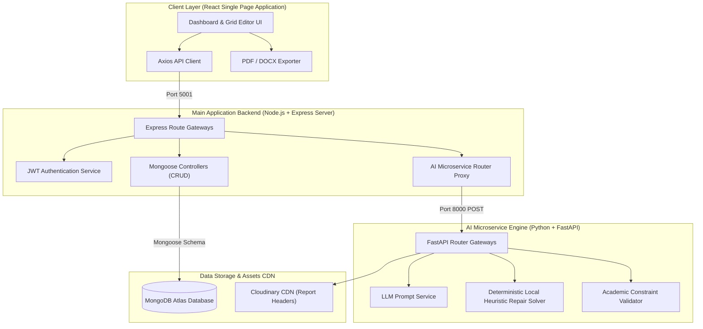
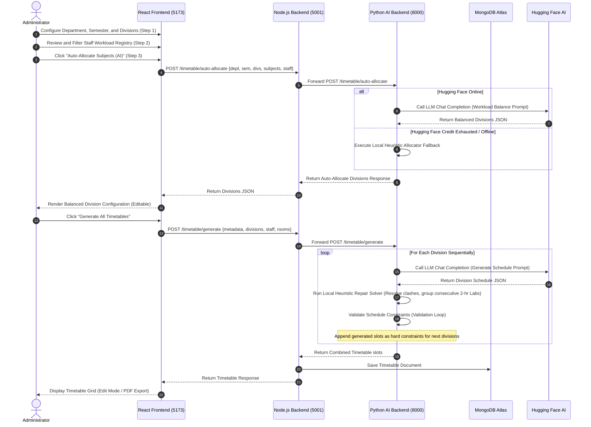

# 🗓️ Intelligent AI Timetable Generator Tool

A state-of-the-art, 3-tier academic timetable scheduling system. The application combines **Large Language Model (LLM) reasoning** with **deterministic constraint-satisfaction algorithms**, a **local heuristic fallback solver**, and an **interactive grid editor** to generate, refine, and manage conflict-free schedules across multiple divisions, classes, and instructors.

---

## 🏗️ Detailed Architecture

The system is built on a robust 3-tier architecture separating the user interface, master data operations, and the AI scheduling engine.

### Architectural Responsibilities:
1. **Frontend Layer (Vite + React)**: Renders the glassmorphic administration cockpit. Manages wizard step states, filters, grid modifications, and generates client-side exports (PDF and DOCX formats).
2. **Main Application Backend (Node.js)**: Responsible for authentication (JWT), token signing, and direct CRUD operations on MongoDB. Proxies auto-allocation and timetable scheduling requests to the Python microservice.
3. **AI microservice (FastAPI)**: Serves as a CPU-bound AI processing service. Converts master data into contextual prompt configurations, interfaces with Hugging Face serverless chat completion APIs, and validates schedules.

---

## 🧭 System Endpoints & Routing

### 1. Main Node.js Application Backend (Port 5001)

#### 🔐 User Authentication
- `POST` `/auth/register` — Register a new administrator account.
- `POST` `/auth/login` — Authenticate credentials and return a signed JWT token.

#### 🎓 Staff (Lecturers) Registry
- `GET` `/staff` — Retrieve all registered staff members (supports query parameter `q`).
- `POST` `/staff` — Register a new lecturer profile.
- `PUT` `/staff/:id` — Update designation, department, semesters, availability, or workload limits.
- `DELETE` `/staff/:id` — Remove a lecturer profile.

#### 📚 Subjects Directory
- `GET` `/subjects` — Retrieve all subject details (supports query parameter `q`).
- `POST` `/subjects` — Register a new subject.
- `PUT` `/subjects/:code` — Update subject parameters.
- `DELETE` `/subjects/:code` — Remove a subject from registry.

#### 🏫 Classrooms & Laboratories
- `GET` `/classrooms` — List classrooms.
- `POST` `/classrooms` — Add a classroom.
- `PUT` `/classrooms/:id` — Update classroom parameters.
- `DELETE` `/classrooms/:id` — Delete a classroom.
- `GET` `/labs` — List laboratories.
- `POST` `/labs` — Add a lab room.
- `PUT` `/labs/:id` — Update lab parameters.
- `DELETE` `/labs/:id` — Delete a lab room.

#### 🗓️ Timetable Operations
- `GET` `/timetable/stats` — Fetch dashboard metrics.
- `GET` `/timetable/list/all` — List generated timetables.
- `GET` `/timetable/:timetableId` — Retrieve a specific timetable.
- `POST` `/timetable/auto-allocate` — Auto-allocate subjects and teachers (forwarded to Python).
- `POST` `/timetable/generate` — Generate a timetable from scratch (forwarded to Python).
- `POST` `/timetable/regenerate` — Reschedule an existing timetable with updated constraints.
- `PUT` `/timetable/:timetableId/slots` — Save manual grid overrides.
- `DELETE` `/timetable/:timetableId` — Delete a timetable.

---

### 2. Python AI Backend Microservice (Port 8000)
- `GET` `/` — Service health check.
- `POST` `/timetable/auto-allocate` — Balances workload and assigns teachers to subjects.
- `POST` `/timetable/generate` — Formulates single-division timetables sequentially.
- `POST` `/timetable/regenerate` — Re-schedules slots under additional manual parameters.

---

## 🔄 Dynamic Timetable Workflow

### 1. Sequential Workflow Diagram

---

### 2. Detailed Textual Step-by-Step Workflow

#### Step 1: Resource Setup & Filtering
1. **Master Registries**: Administrators pre-populate the **Staff**, **Subjects**, **Classrooms**, and **Laboratories** databases using the management dashboard pages.
2. **Academic Filters**: When starting a new timetable creation, the wizard filters all subjects and teachers dynamically based on the selected **Department** and **Semester**.

#### Step 2: Auto-Allocation (AI Load Balancing)
1. **Request Payload**: Clicking "Auto-Allocate Subjects" gathers active semester subjects and active teachers, and transmits them to the server.
2. **AI Allocation**: The Hugging Face API distributes subjects evenly across divisions. Eligible lecturers are assigned based on their designated weekly workloads and preferred teaching subjects.
3. **Local Fallback**: If Hugging Face is unavailable or your API key is out of credits (returning a `402` error), the Python engine runs the `local_heuristic_allocation` fallback algorithm to execute the load balancing locally in `<1ms`.
4. **Interactive Adjustment**: The balanced divisions are returned to the frontend. Administrators can click **Edit** on any row to adjust lecturers, periods, or rooms before generation.

#### Step 3: Timetable Generation & Heuristic Repair
1. **Sequential Generation**: Clicking "Generate All Timetables" starts the generation process. The microservice schedules divisions one-by-one.
2. **AI Drafting**: The LLM compiles an initial schedule matching the specified constraints.
3. **Local Heuristic Repair**: The drafted slots are processed by the Python **Constraint Repair Solver** (`repair_division_slots_full`):
   - **Double-booking Correction**: Instantly relocates overlapping teacher or room slots.
   - **Consecutive Lab Blocks**: Groups Lab subjects into **consecutive 2-period (2-hour) blocks** on the same day in a specialized laboratory room.
   - **Distribution Optimization**: Spreads Theory lectures across working days to ensure at most 2 periods of a subject per day.
4. **Validation Check**: The validator checks constraints. Once approved, these slots are marked as busy/occupied and passed as hard constraints to the next division.

#### Step 4: Grid Editing & Official Export
1. **Fine-Tuning**: Administrators view the final multi-division schedule. Toggling **Edit Mode** opens a modal to manually update or remove any cell.
2. **Official Reports**: Download division timetables as formatted **PDF** or **Word** documents complete with letterhead, metadata, and validation signature zones.
